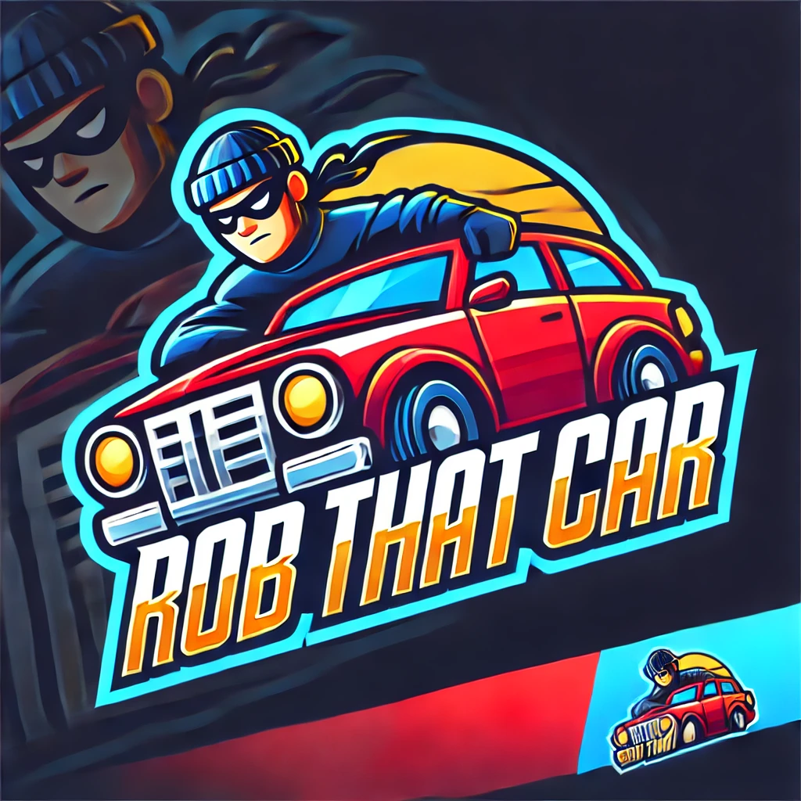

# robthatcar

Top down shooter where you might steal a car or two...

This first version (v0.1 alpha) includes:
* Basic menu
* Settings menu with control mapping and default controls
* Pause functionality (press ESC)
* Walk around (default: WASD) and aim with the mouse
* World (map) with boundaries where player and enemies can roam around
* Enemy spawning (enemies have health bars)
* Shoot at enemies (default: Left Mouse Button)
* Three guns: pistol, machine gun, sniper rifle (with images and sounds)
* Health and armor system (armor reduces the hits)
* Scoring system (depicted in $) based on distance from enemy
* High score saving
* Ambient background sounds
* Wave Function Collapse for different terrain types
* Enemies that aim at the player (and can also hit other NPCs)
* Weapon wheel (default: press and hold TAB)
* Minimap showing location, player and enemies

Features we're working on:
* Overall code optimizations, removing redundancy
* Collision feature (walls)
* Melee attack
* More weapons
* Cops and wanted levels
* Improve Wave Function Collapse (to build proper worlds)